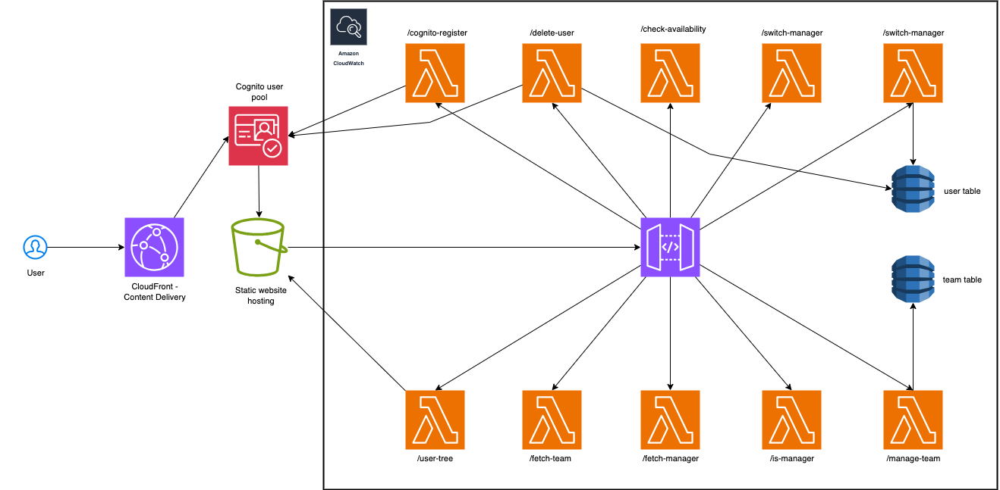
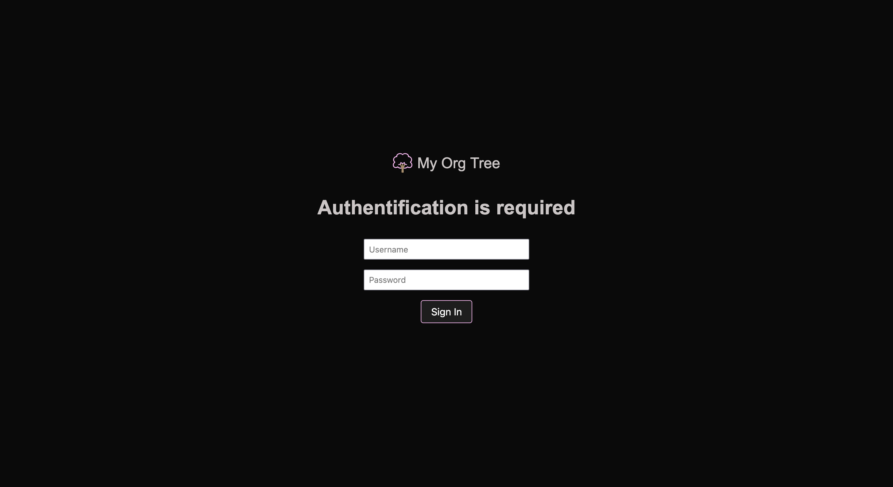
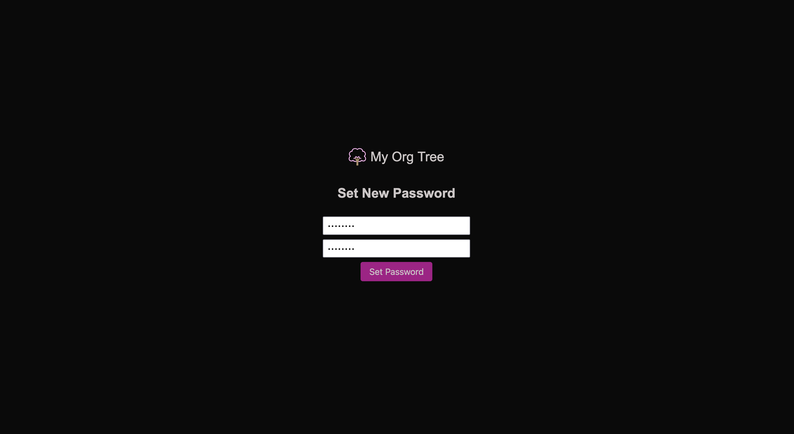
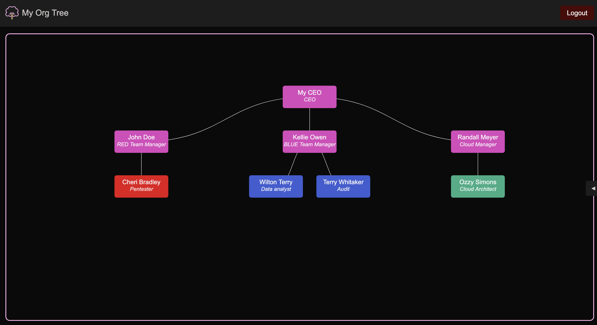
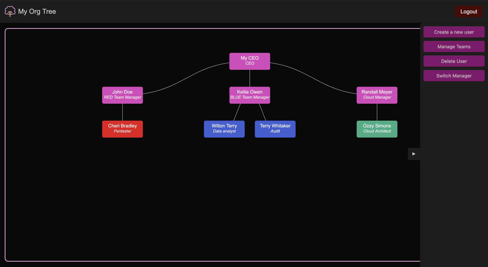
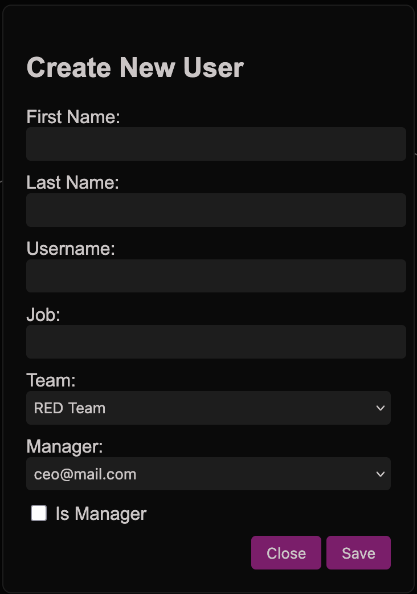
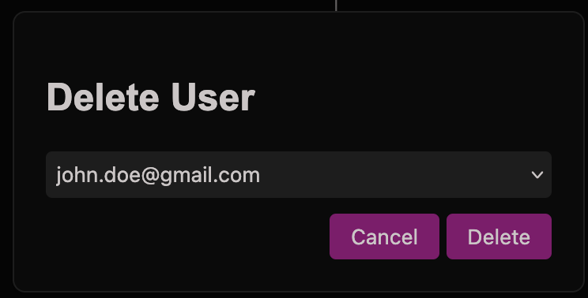
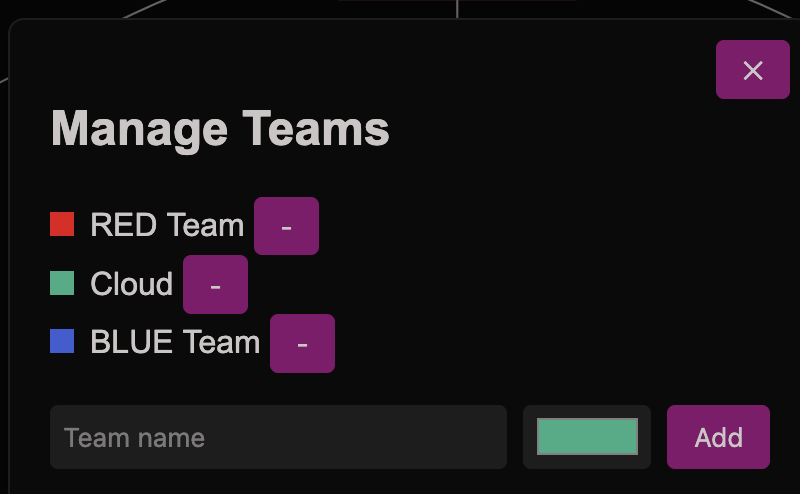
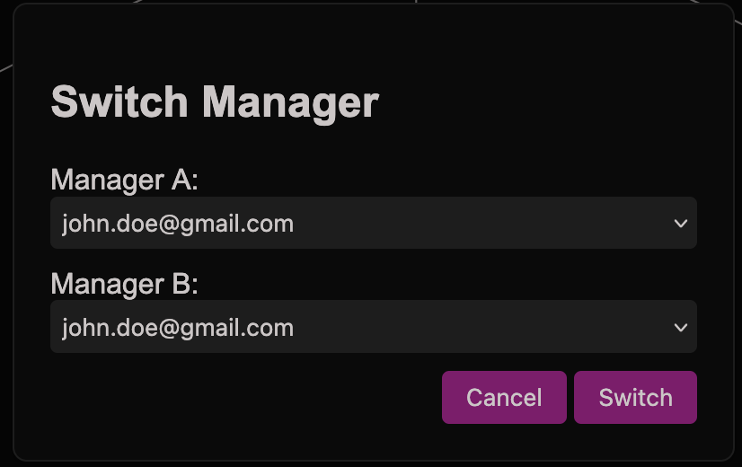
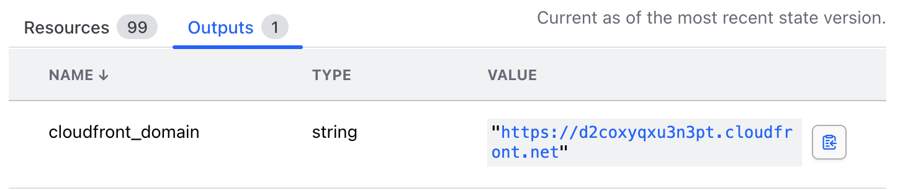

# My Organisation Tree

This project demonstrates the use of Terraform with AWS by provisioning a simple web application equipped with an authentication page. The application allows you to manage your organization’s users (create, delete, switch, etc.) through a hierarchy of groups, managers, and employees.


## Prerequisites

To run this project, make sure you have:

- **Terraform** installed (v1.x recommended).
- **AWS credentials** available as environment variables:
  - `AWS_ACCESS_KEY_ID`
  - `AWS_SECRET_ACCESS_KEY`

> You can load real values from a `.env` or your CI/CD secrets manager.

## Terraform Cloud / Remote Backend

This project uses **Terraform Cloud** as a remote backend. You can keep that setup or switch to a different backend if you prefer.

### Option A — Terraform Cloud (recommended)

Edit `infra/main.tf` and set your organization and workspace:


```hcl
terraform {

  backend "remote" {
    organization = "YOUR_ORG"
    workspaces {
      name = "YOUR_WORKSPACE"
    }
  }
}
```
### Option B — Local state (for quick testing)

If you don’t want a remote backend, you can use local state:


```hcl
terraform {
  backend "local" {
    path = "./terraform.tfstate"
  }
}
```

### Environment and Terraform variables

To run the stack, define the following variables. Use **environment variables** for AWS credentials and **Terraform variables** for project-specific values.

| Variable               | Description                                                                 | Type        |
|-------------------------|-----------------------------------------------------------------------------|-------------|
| `AWS_ACCESS_KEY_ID`     | AWS access key ID provided as an environment variable.                      | env         |
| `AWS_SECRET_ACCESS_KEY` | AWS secret access key provided as an environment variable.                  | env         |
| `aws_region`            | AWS region where resources will be created.                                | terraform   |
| `admin_family_name`     | Family name of the root administrator user.                                | terraform   |
| `admin_given_name`      | Given name of the root administrator user.                                 | terraform   |
| `admin_password`        | Password for the root administrator user.                                  | terraform   |
| `admin_username`        | Username for the root administrator user.                                  | terraform   |
| `tags`                  | HCL list of tags to be applied as attributes to AWS resources.              | terraform   |


### AWS Policy for Terraform

Terraform requires permissions to create and manage the AWS resources defined in this project. Use the **minimum policy** provided at `infra/policy/My-Org-Tree.json`.

**Attach the policy**

1. In the AWS Console: **IAM → Policies → Create policy**.  
2. Paste the JSON from `infra/policy/My-Org-Tree.json` and create the policy.  
3. Attach the policy to the **IAM user or role** whose credentials (Access Key ID / Secret) Terraform will use.  

---

## AWS Infrastructure

This project provisions a **serverless** architecture that powers the application end-to-end:

- **Amazon S3** — hosts the single-page application (SPA).  
- **AWS CloudFront** — serves as the public entry point for the SPA.  
- **Amazon Cognito** — manages user credentials and authentication.  
- **Amazon API Gateway** — serves as the public entry point for API requests from the SPA.  
- **AWS DynamoDB** — handles data logic and storage for operations.  
- **AWS Lambda** — stateless functions implementing business logic.  
- **Amazon CloudWatch Logs** — centralized logging for debugging and traceability.  



**How it works**

1. The SPA is stored in an S3 bucket secured with an Origin Access Control (OAC), so only CloudFront can serve its content.  
2. CloudFront acts as the public entry point, delivering the SPA to users.  
3. Cognito authenticates users before they can access the application.  
4. (Managers only) User interactions trigger API requests routed through API Gateway.  
5. API Gateway invokes the appropriate Lambda functions.  
6. Lambda functions process requests and return responses to the SPA.  
7. All API activity is logged in **CloudWatch Logs**.  

---

## The Web Application

When accessing the application, you will first be prompted to sign in:



If a user has been created via the web application, they will receive a temporary password. On their first login, they must replace it with a permanent password:



After authentication, users gain access to the main application:



If logged in as a manager, you will have access to the options menu on the right-hand side:



### Creating Users

Managers can create new users by providing their name, surname, email (username), job title, team, manager, and whether they should also be assigned as a manager:



After creation, the new user’s temporary credentials will be displayed in a popup before being added to the hierarchy.  

> You cannot create users under the management of other managers who are above or at the same level as you.  

### Deleting Users

Managers can delete users by selecting them:



> You cannot delete yourself or managers who are above or at the same level as you. Once deleted, all users previously managed by the removed user will be reassigned to the parent manager.  

### Managing Teams

Managers can create or delete teams and assign a specific color, which applies only to that team’s employees:



### Switching Positions

Managers can switch positions if they change teams or need to manage a different group:



> You cannot switch yourself or managers who are above or at the same level as you.  

---

### Accessing the Application

After applying the Terraform configuration, use the URL printed in the Terraform **outputs** to open the application:



---

## Lambdas and DynamoDB Tables

The project deploys multiple Lambda functions and DynamoDB tables. Below is a summary of their responsibilities:

### Lambdas

- **User Tree** — queries DynamoDB and reconstructs the hierarchy tree in JSON format.  
- **Is Manager?** — checks if the current user is a manager in DynamoDB to determine if the options menu should be shown.  
- **Check Availability** — verifies that the selected username/email is not already taken in Cognito.  
- **Cognito Register** — registers the user in Cognito.  
- **Dynamo Register** — stores additional information in DynamoDB to maintain the hierarchy tree.  
- **Fetch Manager** — queries DynamoDB for available managers for dropdown selection.  
- **Fetch Team** — queries DynamoDB for available teams for dropdown selection.  
- **Manage Team** — handles team creation/removal and updates DynamoDB accordingly.  
- **Switch Manager** — updates manager assignments while maintaining tree integrity.  
- **Delete User** — removes a user from DynamoDB and Cognito and reassigns their children to the parent manager.  

### DynamoDB Tables

- **Users** — stores all user-related metadata required to build the hierarchy tree.  
- **Teams** — stores all team information and configurations.  

---

## Possible Improvements

- **Tighten Policy** — while already restricted, the IAM policy could be refined further.  
- **Improved UI/UX** — the current UI is functional but basic; a future version could offer a more interactive and modern design.  
- **Additional Options** — add the ability to edit users and directly insert new users into the hierarchy.  
- **Send Credentials by Email** — credentials could be distributed via email (using AWS SNS), but this requires a domain and mail server.  
- **Complete Cognito Integration** — add email verification, password reset, and other security features not yet implemented.  
